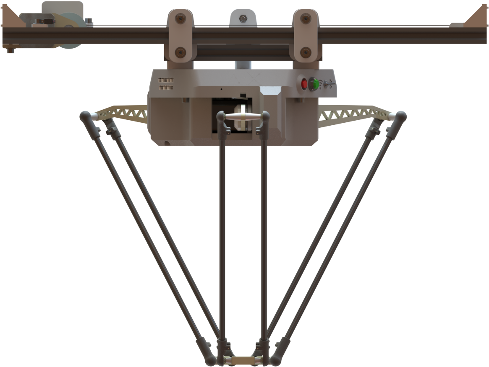

# SLIDER X

`Slider X` is a `Delta Robot Kit component` that help robot can extend working space.

## Specification

|Parameter      |Details   |
|---------------|----------|
|Working Range  |300mm     |
|Max Speed      |80mm/s    |
|Max Accel      |1000mm/s2 |
|Power Supply   |12VDC - 3A|
|Connection     |USB to TTL|
|Control        |G-code    |

## G-CODES control

All g-code is listed at [https://docs.deltaxrobot.com](https://docs.deltaxrobot.com/reference/gcodes/gc_slider/). Visit our site for more information.